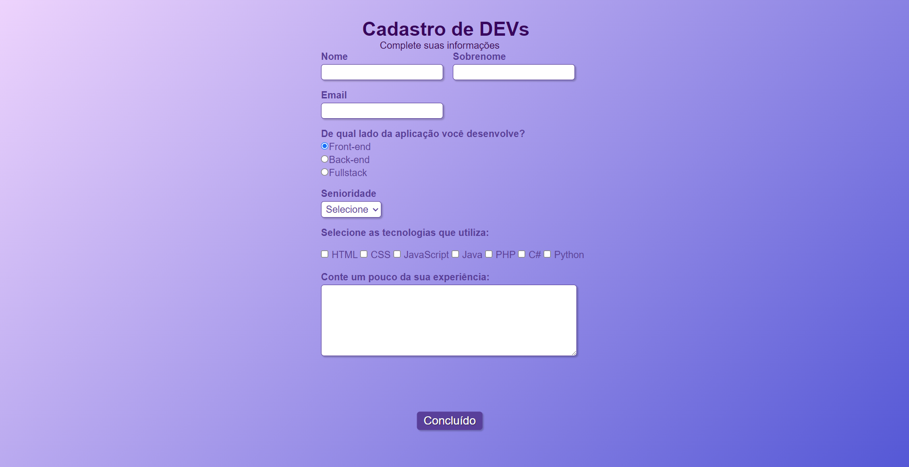

# Formulário Dev

No TechGuide.sh da Alura, foi desenvolvido um projeto de Landing Page básica que continha um formulário direcionado para desenvolvedores, utilizando HTML e CSS. O objetivo do formulário era coletar informações importantes dos devs, como experiência e habilidades técnicas. 

## 🚀 Demonstração

[Clique aqui](https://flaviomattosdev.github.io/Tech-Guide-Alura-Formulario/) para acessar o resultado final do projeto.

## 🛠️ Tecnologias Utilizadas

* [HTML](https://developer.mozilla.org/pt-BR/docs/Web/HTML) - Linguagem de Marcação
* [CSS](https://developer.mozilla.org/pt-BR/docs/Web/CSS) - Linguagem de Estilização

## 👨‍💻 Desenvolvedor

    
    
&nbsp&nbsp&nbspFlávio Mattos 
    &nbsp&nbsp&nbsp<a href="https://www.instagram.com/fflaviomattos/">Instagram</a>&nbsp;|&nbsp;<a href="https://github.com/FlavioMattosDev">GitHub</a>&nbsp;|&nbsp;<a href="https://www.linkedin.com/in/flavio-mattos/">LinkedIn</a>&nbsp;

  

---
